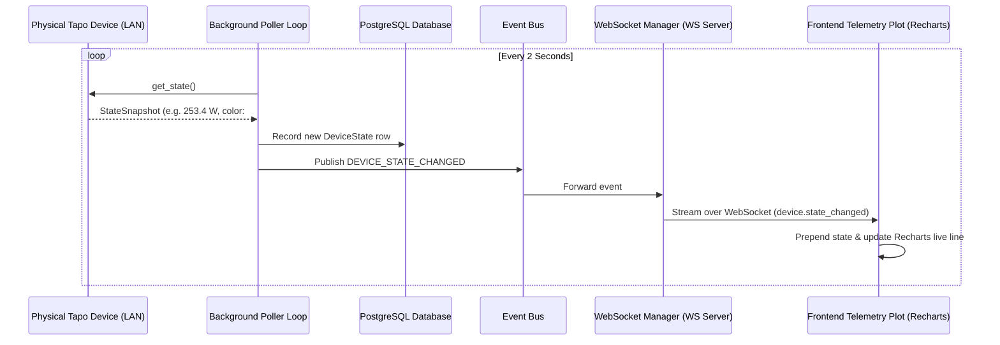

# Domus

Domus is a self-hosted, local-first smart home platform for discovering, managing, automating, and controlling devices from a unified dashboard.


## Stack

- **Frontend**: Next.js 15, React 19, TypeScript, Tailwind CSS, shadcn/ui, TanStack Query, Zustand, React Hook Form, Zod, Socket.IO client
- **Backend**: FastAPI, Python 3.12+, SQLAlchemy, Alembic, PostgreSQL, Redis, Pydantic v2, JWT auth, WebSockets, MQTT

---

## Layout

- `apps/web` - Next.js dashboard and operator UI
- `apps/api` - FastAPI backend and integration adapters
- `packages/shared-types` - Shared TypeScript schemas & contracts
- `packages/shared-config` - Shared configuration helpers
- `docker` - Dockerfiles and deployment support
- `docs` - Architecture and developer documentation
- `scripts` - Local automation helpers

---

## System Architecture & Event Flow

### Architecture Topology
```mermaid
graph TD
    subgraph Frontend (Next.js 15 & React 19)
        UI[Dashboard & Telemetry Plot] <--> Store[Zustand Store]
        Store <--> WS_Client[WebSocket Client]
    end

    subgraph Backend (FastAPI & python-kasa)
        WS_Server[WebSocket Manager] <--> EventBus[Event Bus]
        Poller[Background Poller Loop] -- Polls every 2s --> Adapters[RealTapoAdapter]
        Poller -- Saves state --> DB[(PostgreSQL)]
        Poller -- Publishes event --> EventBus
        EventBus --> WS_Server
    end

    subgraph Physical Hardware (Local LAN)
        Adapters <--> L900[Tapo L900 Lightstrip]
        Adapters <--> P110[Tapo P110 Smart Plug]
    end
```

### Real-Time Telemetry Sequence


---

## Quick Start

1. Install Bun, Node.js, Python 3.12+, PostgreSQL, and Redis.
2. Run `bun install` to set up all workspaces.
3. For the API, create a Python virtual environment in `apps/api` and install with `pip install -e ".[dev]"`.
4. PostgreSQL and Redis are required — use `docker-compose up postgres redis` for local development.
5. Copy environment files as needed and start `web` and `api`.

## Commands

### To Activate Python Virtual Environment

```
& apps/api/.venv/Scripts/Activate.ps1
```

### Web (Frontend)

- `bun run dev:web` — Start Next.js dev server on port 3000
- `bun --filter @domus/web build` — Build for production
- `bun --filter @domus/web lint` — Run ESLint

### API (Backend)

- `bun run dev:api` — Start FastAPI dev server on port 8000 (requires Python venv)
- `bun --filter @domus/api test` — Run pytest tests
- `bun --filter @domus/api lint` — Run ruff and black checks

### Full Stack

- `docker-compose up` — Spin up web, api, postgres, and redis
- `bun run build` — Build both web and api
- `bun run lint` — Lint all workspaces
- `bun run format` — Format code with prettier (Node) and black (Python)

---

## Development Commands

### Web (Frontend)

- `bun run dev:web` — Start Next.js dev server on port `3000`
- `bun --filter @domus/web build` — Build frontend for production
- `bun --filter @domus/web lint` — Run ESLint check

### API (Backend)

*Make sure your Python virtual environment is activated before running backend commands.*

- `bun run dev:api` — Start FastAPI dev server on port `8000`
- `bun --filter @domus/api test` — Run backend pytest test suite
- `bun --filter @domus/api lint` — Run ruff and black code checks

### Full Stack

- `docker-compose up` — Spin up web, api, postgres, and redis
- `bun run build` — Build both web and api workspaces
- `bun run lint` — Lint all workspaces
- `bun run format` — Format code across all workspaces (Prettier & Black)

---

## Documentation Index

Detailed design specifications and architectural guidelines are available in the [docs/](file:///d:/VS-Code/AI%20Expermients/Domus/docs) directory:

*   [Core Architecture](file:///d:/VS-Code/AI%20Expermients/Domus/docs/architecture.md) — Modular monolith structure, domain-driven boundaries, and coding rules.
*   [Frontend Guide](file:///d:/VS-Code/AI%20Expermients/Domus/docs/frontend/README.md) — Design system tokens, state management (Zustand), and repository layer patterns.
*   [Backend Guide](file:///d:/VS-Code/AI%20Expermients/Domus/docs/backend/README.md) — FastAPI design, DB connections, and device adapter implementations.
*   [Automations Engine](file:///d:/VS-Code/AI%20Expermients/Domus/docs/backend/automations.md) — Logic behind rule triggers, trigger types, and system execution.
*   [Real-time Events](file:///d:/VS-Code/AI%20Expermients/Domus/docs/backend/realtime.md) — Event broker setup, event publishing, and WebSocket managers.

---

## Live Real-Time Polling & WebSockets

Domus supports live, real-time telemetry streaming for active online devices. 

- **Background Polling Loop**: A background worker (located in `apps/api/backend/devices/poller.py`) runs continuously every 2 seconds. It fetches online devices, queries their physical hardware adapters (like TP-Link Tapo L900/P110 devices) for live attributes (e.g. brightness, color, current power draw in Watts), and records state snapshots in PostgreSQL.
- **WebSocket Streaming**: Updates are published to the event bus and instantly broadcasted to connected browser clients over WebSockets (`device.state_changed` event). The frontend dashboard page and history charts update reactively in real-time.

---

## License

This project is licensed under the **Domus Personal Use License**. 

**Free to Use, Not Free to Copy**. You are free to self-host and run this software for your own personal, non-commercial use. However, you may not distribute, sublicense, sell, copy, or redistribute the source code or binaries to any third party. See the [LICENSE](file:///d:/VS-Code/AI%20Expermients/Domus/LICENSE) file for details.
