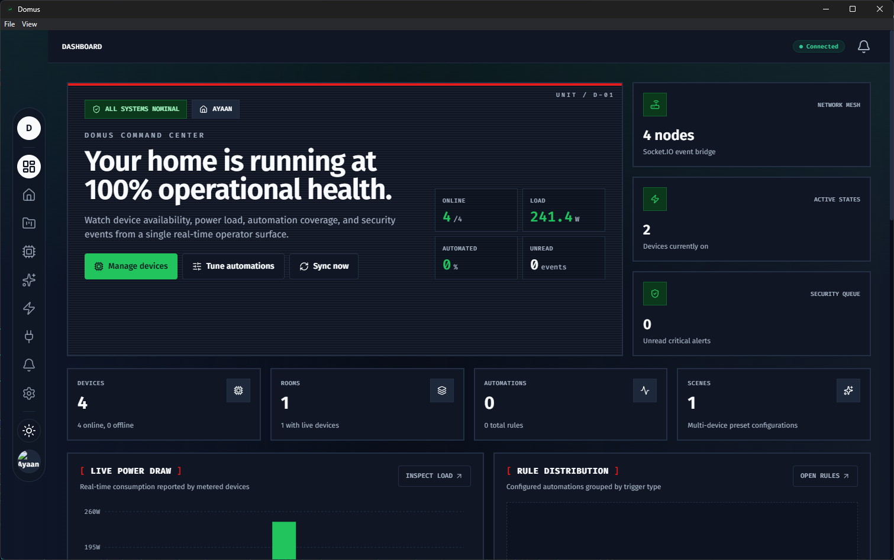
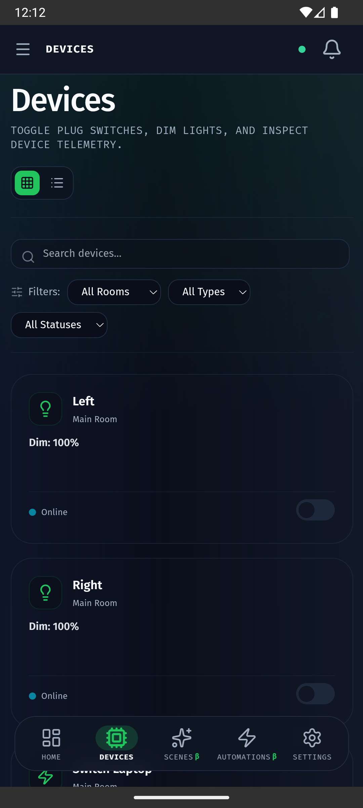

#  Domus

Domus is a self-hosted, local-first smart home platform for discovering, managing, automating, and controlling devices from a unified dashboard.


Runs from one codebase on **web, installable PWA, Android, iOS, Windows, and macOS** (via Capacitor). See **[RUNNING.md](./RUNNING.md)** for build & run instructions for every platform.

## Screenshots

| Devices | Device Details | Integrations |
| --- | --- | --- |
|  |  |  |

| Desktop | Mobile |
| --- | --- |
|  |  |

**Demo:** Ambient Sync screen share — mirror your screen's ambient lighting to your smart lights in real time.

<video src="./pic/demo.mp4" controls width="600"></video>

## Stack

- **Frontend**: Next.js 15, React 19, TypeScript, Tailwind CSS, shadcn/ui, TanStack Query, Zustand, React Hook Form, Zod, Socket.IO client
- **Backend**: FastAPI, Python 3.12+, SQLAlchemy, Alembic, PostgreSQL, Redis, Pydantic v2, JWT auth, WebSockets, MQTT

---

## Layout

- `apps/web` - Next.js dashboard and operator UI
- `apps/api` - FastAPI backend and integration adapters
- `packages/shared-types` - Shared TypeScript schemas & contracts
- `packages/shared-config` - Shared configuration helpers
- `docker` - Dockerfiles and deployment support
- `docs` - Architecture and developer documentation
- `scripts` - Local automation helpers

---

## System Architecture

```
┌──────────────────────────────────────────────────────────────────┐
│                        DOMUS — SYSTEM OVERVIEW                    │
├──────────────────────────────────────────────────────────────────┤
│                                                                   │
│  ┌───────────────────── FRONTEND (Next.js 15) ─────────────────┐ │
│  │                                                              │ │
│  │   Dashboard · Devices · Rooms · Homes · Automations          │ │
│  │   Scenes · Integrations · Notifications · Settings           │ │
│  │                                                              │ │
│  │   ┌─────────────┐          ┌───────────────┐                 │ │
│  │   │  Zustand    │◄────────►│  TanStack     │   REST + WS     │ │
│  │   │  (UI/WS)    │          │  Query (API)  │◄────◆───◆────── │ │
│  │   └──────┬──────┘          └───────────────┘     │   │      │ │
│  │          │                                        │   │      │ │
│  │   ┌──────▼──────┐                                 │   │      │ │
│  │   │  WebSocket  │◄──── Real-time push ────────────┘   │      │ │
│  │   │  Client     │                                      │      │ │
│  │   └─────────────┘                                      │      │ │
│  └────────────────────────────────────────────────────────│──────┘ │
│                                                            │       │
│  ┌───────────────────── BACKEND (FastAPI) ────────────────│──────┐ │
│  │                                                       │      │ │
│  │  ┌──────┐ ┌────────┐ ┌──────┐ ┌──────┐ ┌────────┐    │      │ │
│  │  │Auth  │ │ Device │ │Room  │ │Home  │ │Scene   │   REST    │ │
│  │  │(JWT) │ │Router  │ │Router│ │Router│ │Router  │◄───────┘ │ │
│  │  └──────┘ └───┬────┘ └──────┘ └──────┘ └───┬────┘          │ │
│  │               │                             │               │ │
│  │  ┌────────────┴──────┬────────────┬─────────┴──────────┐    │ │
│  │  │   Event Bus (in-process async pub/sub)              │    │ │
│  │  │   + optional Redis bridge for multi-process fan-out │    │ │
│  │  └──┬─────────┬──────────┬───────────┬─────────────────┘    │ │
│  │     │         │          │           │                      │ │
│  │  ┌──▼──┐ ┌────▼────┐ ┌──▼───┐ ┌─────▼──────┐              │ │
│  │  │ WS  │ │ Device  │ │MQTT  │ │Automation  │              │ │
│  │  │ Mgmt│ │ Poller  │ │Client│ │Engine      │              │ │
│  │  │     │ │ (2s)    │ │      │ │(triggers)  │              │ │
│  │  └─────┘ └────┬────┘ └──────┘ └────────────┘              │ │
│  │               │                                            │ │
│  │  ┌────────────▼────────────────────────────────────────┐   │ │
│  │  │         Integration Adapters                        │   │ │
│  │  │  Tapo · Tuya · Xiaomi · Kasa · MQTT · Matter · Zig │   │ │
│  │  └────────────────────┬───────────────────────────────┘   │ │
│  │                       │                                   │ │
│  │  ┌────────────────────▼────────────────────────────────┐  │ │
│  │  │  Persistence: PostgreSQL (SQLAlchemy) · Redis       │  │ │
│  │  └─────────────────────────────────────────────────────┘  │ │
│  └────────────────────────────────────────────────────────────┘ │
│                                                                  │
│  ┌────── SHARED PACKAGES ──────┐  ┌─────── HARDWARE ─────────┐ │
│  │  shared-types  (Zod/TS)     │  │  Tapo · Xiaomi · Tuya    │ │
│  │  shared-config (constants)  │  │  Zigbee · MQTT · Matter  │ │
│  └─────────────────────────────┘  └──────────────────────────┘ │
└──────────────────────────────────────────────────────────────────┘
```

### Event Flow (2s Poll Loop)

```
 ┌──────────┐    get_state()     ┌──────────────┐
 │  Device  │◄───────────────────│   Poller     │
 │ (Hardware)│──────────────────►│  (every 2s)  │
 └──────────┘  StateSnapshot     └───┬───┬───┬──┘
                                     │   │   │
                      ┌──────────────┘   │   └──────────────┐
                      ▼                  ▼                  ▼
               ┌───────────┐    ┌────────────┐    ┌─────────────────┐
               │PostgreSQL │    │  Event Bus  │    │ Adapter Config  │
               │ (history) │    │  (publish)  │    │ (device lookup) │
               └───────────┘    └──────┬─────┘    └─────────────────┘
                                       │
                              ┌────────▼────────┐
                              │  WebSocket Mgr  │
                              │  (broadcast)    │
                              └────────┬────────┘
                                       │ device.state_changed
                              ┌────────▼────────┐
                              │  Frontend UI    │
                              │  (Recharts/     │
                              │   Zustand)      │
                              └─────────────────┘
```

---

## Database Schema

The database uses PostgreSQL with SQLAlchemy ORM. All primary keys are UUIDs.

The authorization and tenancy boundary is the **Home** entity — all core entities (devices, rooms, scenes, automations, notifications, integrations) carry a `home_id` column referencing `homes.id` to enforce strict workspace isolation.

```
┌─────────────────────────────────────────────────────────────────────────────────────────────┐
│                            DOMUS — DATABASE TABLE RELATIONSHIPS                             │
├─────────────────────────────────────────────────────────────────────────────────────────────┤
│                                                                                             │
│                                      ┌───────────────┐                                      │
│                                      │     users     │                                      │
│                                      └───────┬───────┘                                      │
│                                              │                                              │
│                                  ┌───────────┴───────────┐                                  │
│                        (user_id) │                       │ (owner_id)                       │
│                                  ▼                       ▼                                  │
│                          ┌───────────────┐       ┌───────────────┐                          │
│                          │refresh_tokens │       │     homes     │                          │
│                          └───────────────┘       └───────┬───────┘                          │
│                                                           │                                 │
│       ┌──────────────────┬──────────────┬────────────────┼───────────────┐                  │
│       │                  │              │                │               │                  │
│       ▼                  ▼              ▼                ▼               ▼                  │
│ ┌───────────┐     ┌─────────────┐  ┌─────────┐     ┌─────────────┐  ┌─────────┐             │
│ │automations│     │notifications│  │  rooms  │     │integrations │  │  scenes │             │
│ └───────────┘     └─────────────┘  └────┬────┘     └──────┬──────┘  └────┬────┘             │
│                                         │                 │              │                  │
│                                 room_id │                 │              │                  │
│                               (nullable)│                 │integration_id│                  │
│                                         └───────┐ ┌───────┘              │                  │
│                                                 ▼ ▼                      │                  │
│                                           ┌───────────┐                  │                  │
│                                           │  devices  │                  │                  │
│                                           └─────┬─────┘                  │                  │
│                                                 │                        │                  │
│                                       ┌─────────┴─────────┐              │                  │
│                             device_id │                   │ device_id    │                  │
│                                       ▼                   ▼              ▼                  │
│                               ┌───────────────┐   ┌──────────────────────▼┐                 │
│                               │ device_states │   │  scene_device_states  │                 │
│                               └───────────────┘   └───────────────────────┘                 │
│                                                                                             │
│   ┌─────────────────────────────────────────────────────────────────────────────────────┐   │
│   │ Note: All entity tables (automations, notifications, rooms, integrations, scenes,   │   │
│   │ devices) carry a home_id foreign key referencing homes.id.                          │   │
│   └─────────────────────────────────────────────────────────────────────────────────────┘   │
│                                                                                             │
│                                      ┌─────────────────┐                                    │
│                                      │ alembic_version │ (Standalone migration history)     │
│                                      └─────────────────┘                                    │
└─────────────────────────────────────────────────────────────────────────────────────────────┘
```

---

## Quick Start

1. Install Bun, Node.js, Python 3.12+, PostgreSQL, and Redis.
2. Run `bun install` to set up all workspaces.
3. For the API, create a Python virtual environment in `apps/api` and install with `pip install -e ".[dev]"`.
4. PostgreSQL and Redis are required — use `docker-compose up postgres redis` for local development.
5. Copy environment files as needed and start `web` and `api`.

## Commands

### To Activate Python Virtual Environment

```
& apps/api/.venv/Scripts/Activate.ps1
```

### Web (Frontend)

- `bun run dev:web` — Start Next.js dev server on port 3000
- `bun --filter @domus/web build` — Build for production
- `bun --filter @domus/web lint` — Run ESLint

### API (Backend)

- `bun run dev:api` — Start FastAPI dev server on port 8000 (requires Python venv)
- `bun --filter @domus/api test` — Run pytest tests
- `bun --filter @domus/api lint` — Run ruff and black checks

### Full Stack

- `docker-compose up` — Spin up web, api, postgres, and redis
- `bun run build` — Build both web and api
- `bun run lint` — Lint all workspaces
- `bun run format` — Format code with prettier (Node) and black (Python)

---

## Development Commands

### Web (Frontend)

- `bun run dev:web` — Start Next.js dev server on port `3000`
- `bun --filter @domus/web build` — Build frontend for production
- `bun --filter @domus/web lint` — Run ESLint check

### API (Backend)

_Make sure your Python virtual environment is activated before running backend commands._

- `bun run dev:api` — Start FastAPI dev server on port `8000`
- `bun --filter @domus/api test` — Run backend pytest test suite
- `bun --filter @domus/api lint` — Run ruff and black code checks

### Full Stack

- `docker-compose up` — Spin up web, api, postgres, and redis
- `bun run build` — Build both web and api workspaces
- `bun run lint` — Lint all workspaces
- `bun run format` — Format code across all workspaces (Prettier & Black)

---

## Database Management (pgAdmin)

If you are using the local services stack (`docker-compose.dev.local.yml`), pgAdmin is available at [http://localhost:5050](http://localhost:5050).

Log in using the credentials defined in your `.env` file (default: `admin@domus.com` / `admin`).

To register the PostgreSQL server in pgAdmin:

- **General Tab**:
  - **Name**: `Domus Local` (or any custom name)
- **Connection Tab**:
  - **Host name/address**: `postgres` (use `postgres` because pgAdmin runs inside the Docker network; do not use `localhost` here)
  - **Port**: `5432`
  - **Maintenance database**: `domus`
  - **Username**: `domus`
  - **Password**: `domus`
  - **Save password?**: Checked / Toggle On

---

## Documentation Index

Detailed design specifications and architectural guidelines are available in the [docs/](file:///d:/VS-Code/AI%20Expermients/Domus/docs) directory:

- [Core Architecture](file:///d:/VS-Code/AI%20Expermients/Domus/docs/architecture.md) — Modular monolith structure, domain-driven boundaries, and coding rules.
- [Frontend Guide](file:///d:/VS-Code/AI%20Expermients/Domus/docs/frontend/README.md) — Design system tokens, state management (Zustand), and repository layer patterns.
- [Backend Guide](file:///d:/VS-Code/AI%20Expermients/Domus/docs/backend/README.md) — FastAPI design, DB connections, and device adapter implementations.
- [Automations Engine](file:///d:/VS-Code/AI%20Expermients/Domus/docs/backend/automations.md) — Logic behind rule triggers, trigger types, and system execution.
- [Real-time Events](file:///d:/VS-Code/AI%20Expermients/Domus/docs/backend/realtime.md) — Event broker setup, event publishing, and WebSocket managers.

---

## Live Real-Time Polling & WebSockets

Domus supports live, real-time telemetry streaming for active online devices.

- **Background Polling Loop**: A background worker (located in `apps/api/backend/devices/poller.py`) runs continuously every 2 seconds. It fetches online devices, queries their physical hardware adapters (like TP-Link Tapo L900/P110 devices) for live attributes (e.g. brightness, color, current power draw in Watts), and records state snapshots in PostgreSQL.
- **WebSocket Streaming**: Updates are published to the event bus and instantly broadcasted to connected browser clients over WebSockets (`device.state_changed` event). The frontend dashboard page and history charts update reactively in real-time.

---

## License

This project is licensed under the **Domus Personal Use License**.

**Free to Use, Not Free to Copy**. You are free to self-host and run this software for your own personal, non-commercial use. However, you may not distribute, sublicense, sell, copy, or redistribute the source code or binaries to any third party. See the [LICENSE](file:///d:/VS-Code/AI%20Expermients/Domus/LICENSE) file for details.
docs
